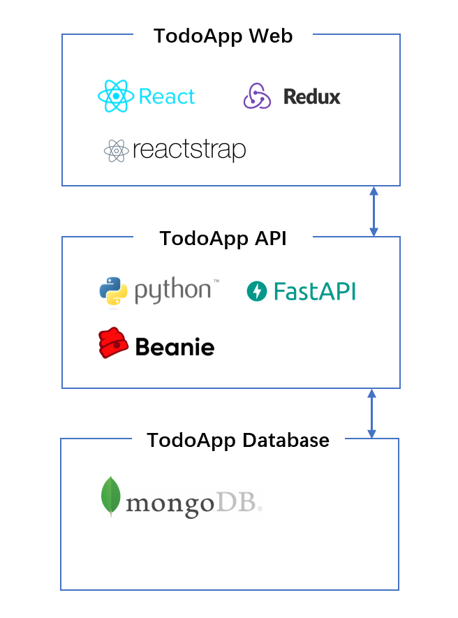

# TodoApp API

## Architecture
### Application

Overall Backend API and Frontend use the FARM (FastAPI, React, and MongoDB
) techstack.



While specifically for backend, it's:
`Python + FastAPI + mongoDB + beanie(mongo ODM)`

For `beanie`: it is an asynchronous Python object-document mapper (ODM) for MongoDB with Data models based on Pydantic.


## Setup

Requirements:
* Python (3.10+)

Install Python dependencies:

```bash
# using bash on Linux like system
$ python -m venv myenv
$ source myenv/bin/activate`

# using bash on Windows(cygwin / git bash)
$ python -m venv myenv
$ source myenv/Scripts/activate`

$ pip install -r requirements.txt
```

Local MongoDB host and db name configured in `.env`
```bash
MONGODB_URL='mongodb://localhost:27017/'
MONGODB_NAME='todoDB'
```

React fronetned host configured in `main.py`
```bash
origins = ['http://localhost:3000',
           'http://localhost:5173'
           ]
```

## Running

To run the local server:
```bash
uvicorn main:app --reload
```
 

To check the API docs, navigate the brower to `http://127.0.0.1:8000/`

 


## Reference

1. MongoDB Compass (GUI) to check the todo list and todo item:


